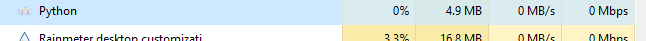

# 🔔 NotifyMate - Desktop Notifier App in Python

**NotifyMate** is a simple yet fun Python application that shows desktop pop-up notifications 💬. You’ll receive reminders or messages whenever the app is triggered — making it your digital bestie for productivity, care, or even love notes! 💖

---

## 💡 Where Can You Use It?

Get creative! NotifyMate is super flexible:

- 💊 Daily medication reminders  
- 💧 Hourly water alerts  
- 🎉 Birthday notifications  
- 🧘‍♀️ Gym/yoga reminders  
- 🔁 App usage alerts  
- 📢 Limited-time deals  
- 🗳️ Collect user feedback  
 - ❓ Ask a question or show a custom tip  

✨ You decide how NotifyMate fits your day!

---

## 📦 What Do You Need?

### ⚙️ Plyer

*Plyer is an open-source library that allows Python to access platform-specific features, like notifications.*

---

## Installing required python packages

*we need to download two important packages for this application.*

*Open your terminal and run the following command.*

- **1.requests** :

in case you want to fetch data from the web

```terminal
 pip install requests
```

- **2. plyer** :

For creating notifications on your PC

```terminal
pip install plyer
```

*Now that we have the packages, we are ready to import it in our python script.*

```py
from plyer import notification
```
Parameters:

- `title (str`) : Title of the notification
- `message (str)` : Message of the notification
- `app_name (str)` : Name of the app launching this notification
- `app_icon (str)` : Icon to be displayed along with the message
- `timeout (int)` : time to display the message for, defaults to 10
- `time.sleep` : After displaying a notification, we will make it sleep for 1 hour or 60 minutes. You can choose a different interval.
- `ticker (str)` : text to display on status bar as the notification arrives
- `toast (bool)` : simple Android message instead of full notification

## Here is how you see your notification after running your application


## How to make a python application to run in the background?

*Just follow this simple command to make your application run in the background, note you need to type this command in command prompt in case you are using Windows and terminal in case you are using Linux.*

> Note: replace the `<your-file-name-here>` with your file name

```terminal
pythonw.exe .\<your-file-name-here>
example 
pythonw.exe .\notifier.py
```

*That's it your application now starts running in the background.*

## How do you confirm that your application is running in the background?

*open task manager in your pc and you can see that in background process you can see python is running.*



## How to stop getting notifications?

If you run into issues or want to suggest cool new ideas for NotifyMate, head over to the Discussions section!

